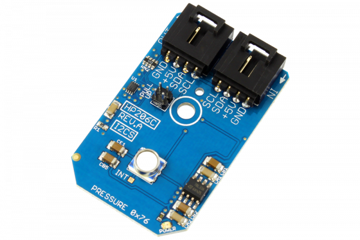

# HP206C

Manufactured by Hope Microelectronics, the HP206C is a high precision barometer and altimeter that measures the pressure and the temperature by an internal 24-bit ADC and compensates the output using a patented algorithm.Easy command-based data acquisition interface and programmable interrupt control is available.Typical active supply current is 5.3 uA per measurement-second while the ADC output is filtered and decimated by 256. Pressure output can be resolved with output in fractions of a Pascal, and Altitude can be resolved in 0.01 meter. The HP206C is specified for operation from -40°C to 85°C
This Device is available from www.ncd.io 

[SKU: HP206C_I2CS]

(https://store.ncd.io/product/hp206c-barometer-and-altimeter-with-24-bit-analog-to-digital-converter-i2c-mini-module/)
This Sample code can be used with Arduino.

Hardware needed to interface HP206C sensor with Arduino

1. <a href="https://store.ncd.io/product/i2c-shield-for-arduino-nano/">Arduino Nano</a>

2. <a href="https://store.ncd.io/product/i2c-shield-for-arduino-micro-with-i2c-expansion-port/">Arduino Micro</a>

3. <a href="https://store.ncd.io/product/i2c-shield-for-arduino-uno/">Arduino uno</a>

4. <a href="https://store.ncd.io/product/dual-i2c-shield-for-arduino-due-with-modular-communications-interface/">Arduino Due</a>

5. <a href="https://store.ncd.io/product/hp206c-barometer-and-altimeter-with-24-bit-analog-to-digital-converter-i2c-mini-module/">HP206C 24Bit ADC and Barometer and Altimeter Sensor</a>

6. <a href="https://store.ncd.io/product/i%C2%B2c-cable/">I2C Cable</a>

HP206C:

Manufactured by Hope Microelectronics, the HP206C is a high precision barometer and altimeter that measures the pressure and the temperature by an internal 24-bit ADC and compensates the output using a patented algorithm.Easy command-based data acquisition interface and programmable interrupt control is available.Typical active supply current is 5.3 uA per measurement-second while the ADC output is filtered and decimated by 256. Pressure output can be resolved with output in fractions of a Pascal, and Altitude can be resolved in 0.01 meter. The HP206C is specified for operation from -40°C to 85°C

Applications:

• SWeather Station Equipment

• HVAC

• Automotive Systems, etc.

How to Use the HP206C Arduino Library

The HP206C is very easy to interface as following.

1.Address calling:The following command is used to call the address of HP206C to start the transmission.

             hp.getAddr_HP206C(HP206C_DEFAULT_ADDRESS);          // 0x76 

2.OSR selection:The following command is used to set OSR.

             hp.setOSR(OSR_4096);            // OSR=4096
            
3.Output measurement:The following command is used to measure the Pressure, Altitude and Temperature.

             hp.Measure_Sensor();
